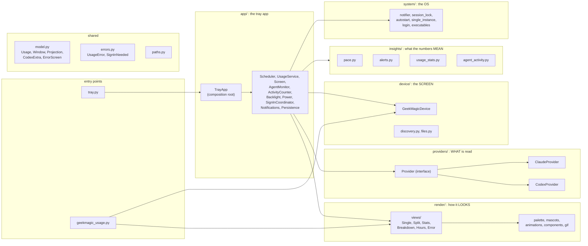
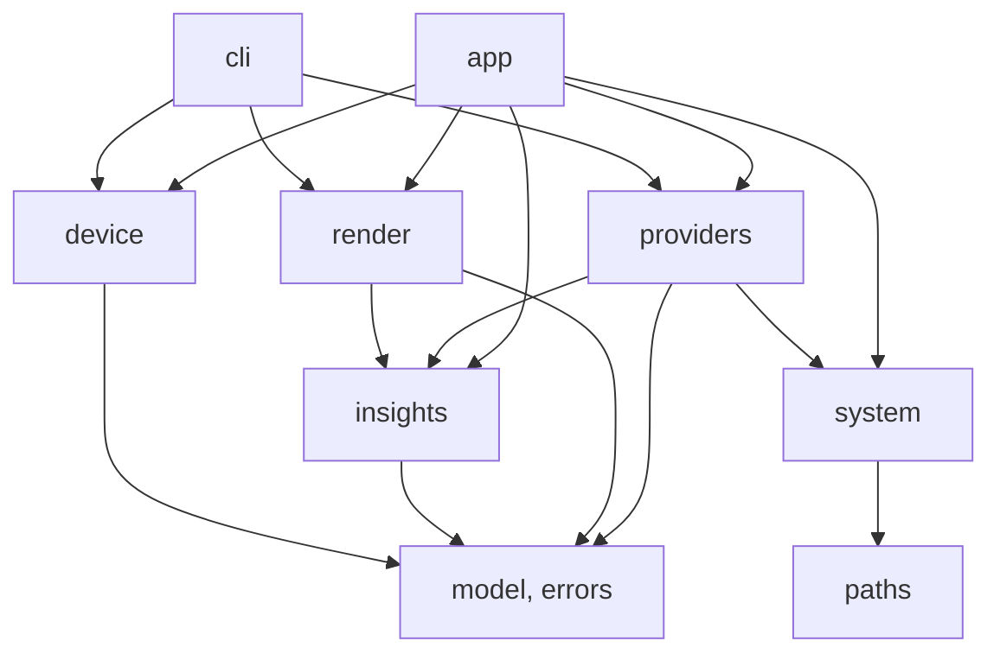
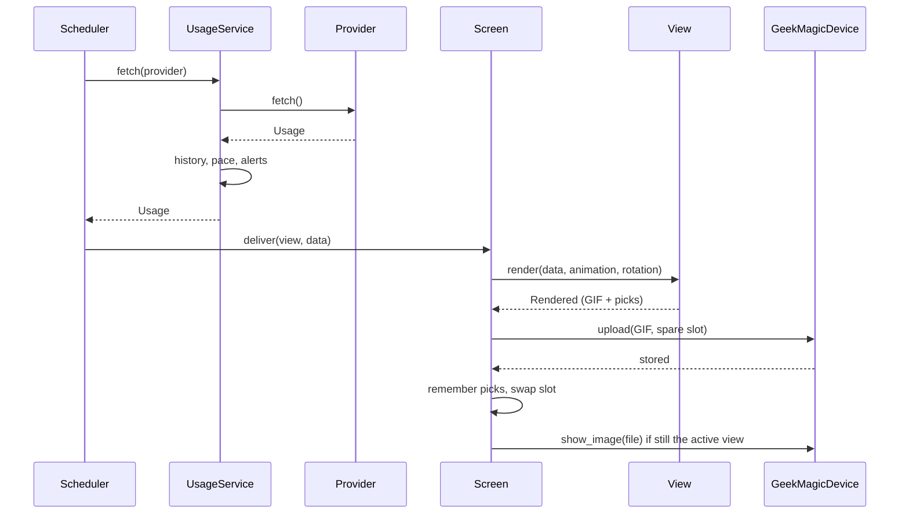

# Architecture

The code lives in the `geekmagic` package. `tray.py` and `geekmagic_usage.py` at the top are one-line launchers (the
start-at-login entry runs `tray.py`).

## Layers

Dependencies point downwards only: `app` uses everything; `providers`, `render` and `device` don't know about
`app`; `render` knows nothing of providers or the network; `system` and `device` know nothing of the rest. A test
(`tests/test_architecture.py`) keeps it that way.

## One update cycle

What the worker does each time (30 s by default, or when a click or an agent change wakes it):

## Patterns, and where to look

| Pattern | Where | What it buys |
|---|---|---|
| **Strategy + registry** | `providers/` (`Provider`) | Everything specific to one AI tool is one class; the app only talks to the interface. |
| **Strategy** | `render/views/` (`View.render`) | Each screen is a class with the same `render(data, animation, rotation) -> Rendered`; a new view is a new class and an entry in `PANEL_VIEWS`. |
| **Facade** | `device/client.py` | The device's odd HTTP API (one request at a time, cancellable uploads, theme selection) behind five methods. |
| **Composition root / DI** | `app/tray_app.py` | Services get their collaborators in the constructor (callbacks for what they must tell the app), so each is testable alone. |
| **Observer (hooks)** | `UsageService.on_read/on_failure`, `AgentMonitor.on_change` | A service reports what happened without knowing who cares. |
| **Memento** | `app/persistence.py` | Each part has `restore(saved)` / `snapshot()`; one file remembers them all and a damaged piece only costs that part's memory. |
| **Value objects** | `model.py` (`Usage`, `Window`...), `render/views/Rendered` | A reading is a typed object, not a dict, so a misspelt field fails at once; a view returns the GIF *and* the rotation picks to remember, and the caller records them only once the upload went through. |

## Adding a provider

1. `geekmagic/providers/<name>.py`: a `Provider` subclass (read its usage, find its CLI, count its logs, say how to sign in).
2. Add its instance to `ALL` in `providers/__init__.py`.
3. Give it a look: a mascot in `render/mascots.py` (`THEMES`) and animations in `render/animations.py`
   (`ANIMATION_GROUPS`, `WORKING_ANIMATION`, `WAITING_ANIMATION`).
4. Where the screen only has room for two panels the app needs a choice of which two; see the history (commit `506755c`) for
   a worked version with a provider selector and a pair of providers for the views of two.

## Adding a view

A class in `render/views/` with `render(...) -> Rendered`, registered in `PANEL_VIEWS`; a name for the tooltip in
`app/viewstate.py` and an icon in `app/icons.py`; a menu item in `app/menu.py`.
