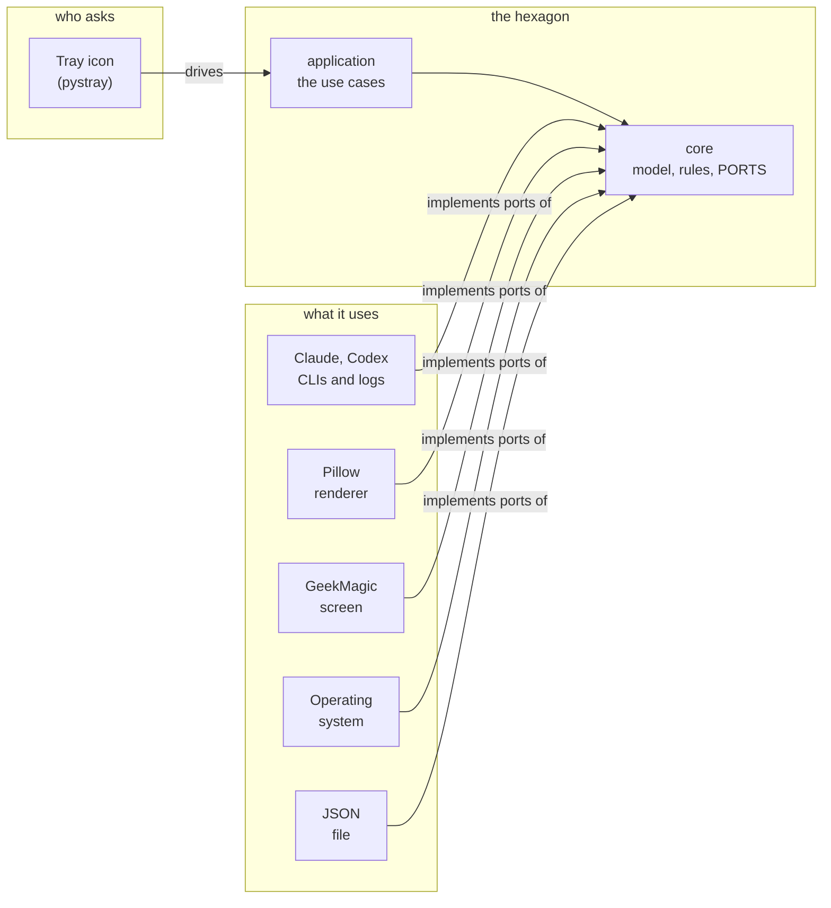
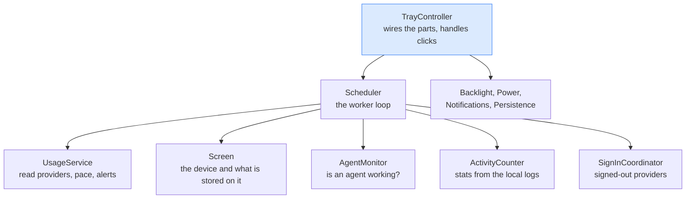
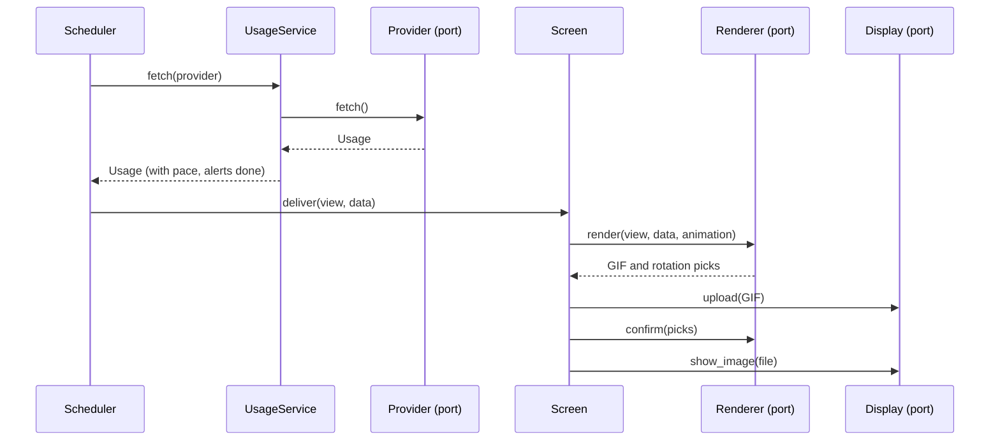

# Architecture

The app follows a **hexagonal architecture** (ports and adapters). What the app *is* sits in the middle and knows nothing
about the outside world; everything it needs from outside (an AI tool, the screen, a drawing library, the operating system)
is described by an interface, a **port**, and provided by an **adapter** that plugs into it.

The rule that makes it an architecture and not just folders: **dependencies only point inwards.**
(`tray.py` and `geekmagic_usage.py` at the top of the repo are one-line launchers; the start-at-login entry runs `tray.py`.)

| Layer | Folder | Knows about | Third-party libraries |
|---|---|---|---|
| **core** | `geekmagic/core/` | nothing | none |
| **application** | `geekmagic/application/` | core | none |
| **adapters (driven)** | `geekmagic/adapters/{providers,render,device,system,store}/` | core and its own folder | only what it adapts (Pillow in `render`) |
| **adapter (driving)** | `geekmagic/adapters/tray/` | core, application | pystray, Pillow |
| **composition root** | `bootstrap.py` (+ the entry points `tray_main.py`, `cli.py`) | everything | |

`tests/test_architecture.py` is this table as a test: it fails if `core` or `application` import an adapter or a third-party
library, or if one adapter imports another.

## Core: what the app is about

- **The model**: `Usage`, `Window`, `Projection`, `ErrorScreen`: typed objects, no dicts.
- **The rules**, pure functions: pace projection, alert thresholds, counting activity from events, merging an agent's sessions.
- **The ports**: the interfaces below. They are the *only* way the application reaches the outside.
- The provider registry, the keys of the views, and how each provider looks (`themes.py`, plain data).

| Port | The application needs... | Adapter |
|---|---|---|
| `Provider` | to read a tool's usage, count its logs, see if its agent is busy, sign in | `adapters/providers/` (Claude, Codex) |
| `Renderer` | readings in, a GIF out | `adapters/render/` (Pillow) |
| `Display` | to store an image on the screen, show it, set the backlight | `adapters/device/client.py` |
| `DeviceLocator` | to find the screen on the network | `adapters/device/discovery.py` |
| `Notifier` | to show a desktop notification | `adapters/system/notifier.py`, and the tray icon itself |
| `StateStore` | to remember things between runs | `adapters/store/json_store.py` |
| `LockSensor` | to know the computer is locked | `adapters/system/session_lock.py` |
| `TerminalLauncher` | to open a terminal that runs a command (a sign-in) | `adapters/system/terminal.py` |
| `Ui` | (driving) to tell the tray icon its title, icon, menu | `adapters/tray/ui.py` |

## Application: the use cases

`TrayController` builds the parts below from the ports it is given, wires them together and answers the icon's clicks. Each part
has one job and receives what it needs in its constructor; none of them can name an adapter.

## One update cycle

What the worker does each time (every 30 s, or when a click or an agent change wakes it). Every participant marked "port" is an
interface: which implementation answers is decided in `bootstrap.py`.

## Patterns, and where to look

| Pattern | Where | What it buys |
|---|---|---|
| **Ports and adapters** | `core/ports.py`, `adapters/` | The application never names a concrete tool, library or device. |
| **Dependency injection / composition root** | `bootstrap.py` | The one place that picks implementations; tests build the controller on fakes (`tests/support.py`), no desktop needed. |
| **Strategy + registry** | `Provider`, `ProviderRegistry` | Everything specific to one AI tool is one class; adding one touches no use case. |
| **Strategy** | `adapters/render/views/` (`View.render`) | Each screen is a class with the same `render(data, animation, rotation) -> Rendered`. |
| **Facade** | `adapters/device/client.py` | The screen's odd HTTP API (one request at a time, cancellable uploads) behind six methods. |
| **Observer (hooks)** | `UsageService.on_read/on_failure`, `AgentMonitor.on_change` | A service reports what happened without knowing who cares. |
| **Memento** | `application/persistence.py` | Each part has `restore(saved)` / `snapshot()`; a damaged piece only costs that part's memory. |
| **Value objects** | `core/model.py`, `core/ports.Rendered` | A reading is a typed object, so a misspelt field fails at once; a render returns the GIF *and* the picks to remember once the upload went through. |

## Adding a provider

1. `geekmagic/adapters/providers/<name>.py`: a class implementing `Provider` (read its usage, find its CLI, count its logs, say
   how to sign in), and its log reader next to it.
2. Add it to `default_providers()` in `adapters/providers/__init__.py`.
3. Give it a look: a mascot and colours in `core/themes.py`, animations in `adapters/render/animations.py`.

Nothing in `application/` changes. (Where the screen has room for only two panels the app needs a choice of which two; see commit
`506755c` for a worked version with a provider selector.)

## Adding a view

A class in `adapters/render/views/` with `render(...) -> Rendered`, registered in `PANEL_VIEWS`; its key and name in `core/views.py`;
an icon in `adapters/tray/icons.py`; a menu item in `adapters/tray/menu.py`.

## Adding another way to drive it

Implement `Ui` (`adapters/tray/ui.py` is the model) and call `build_tray_controller` from `bootstrap.py`. The command-line
script (`cli.py`) is a second, smaller driver that skips the application layer and talks to the adapters directly.
