# geekmagic-claude-usage

Show your **Claude Code** and **Codex** usage limits — the "current session /
5-hour" and "current week" numbers — on a [GeekMagic](https://geekmagic.cc/)
SmallTV's screen, with an animated pixel-art mascot for each. Click a tray icon
to flip between them. **No firmware reflash required** — it uses the device's
stock, unmodified web API.

<table>
<tr>
  <td align="center"><br><b>Claude</b></td>
  <td align="center"><br><b>Codex</b></td>
</tr>
</table>

## How it works

Both providers go through the same pipeline; only step 1 differs.

1. **Read the usage** from the provider's own CLI, using the login you already have:

   | | Claude | Codex |
   |---|---|---|
   | Command | `claude -p --safe-mode --output-format json --max-budget-usd 0.000001 --tools "" --no-session-persistence --no-chrome /usage` | `codex app-server` → `account/rateLimits/read` ([docs](https://learn.chatgpt.com/docs/app-server#6-rate-limits-chatgpt)) |
   | What it is | Claude Code's built-in `/usage`, run in a locked-down zero-tool mode. The result is checked for `total_cost_usd == 0` before it's trusted. | The official account-limits call. It doesn't start a model turn. |
   | Cost | **Never spends a token.** | **Never spends a token.** |
   | Needs | Claude Code installed and logged in | Codex CLI installed and signed in with `codex login` using ChatGPT (an API-key-only login has no plan limits) |

2. **Render** a 240×240 animated GIF with [Pillow](https://python-pillow.org/):
   the mascot doing something (see [Animations](#animations)) plus two usage
   bars with their reset countdowns. Claude is orange/gold with a little
   creature; Codex is blue/violet with a cloud, so you can tell them apart at a glance.
3. **Upload** it straight to the device over HTTP (`POST /doUpload?dir=/image/`),
   switch the device to its Photo Album theme (`GET /set?theme=3`) and pin the
   GIF (`GET /set?img=/image/<file>`).

No custom firmware, no soldering, nothing installed on the device — just a few
plain HTTP calls to the web server it already runs.

## Requirements

- A GeekMagic SmallTV running the stock **[GeekMagicClock/smalltv-ultra](https://github.com/GeekMagicClock/smalltv-ultra)**
  firmware (confirm by opening `http://<device-ip>/settings.html` — the page
  links back to that repo). Other GeekMagic firmware families (SD_RU/SD Pro
  community firmware, the ESP32 "PRO" `.sys` variant) use a **different** API
  and are not supported as-is.
- [Claude Code](https://claude.ai/code) and/or the Codex CLI, installed and
  logged in on the machine that runs this. You only need the one(s) you want to see.
- Python 3.11+ and [Pillow](https://python-pillow.org/). For the tray app also
  `pystray` (macOS: plus `pyobjc`; Windows: plus `tzdata`).
- The device and this machine on the same local network. You don't need to
  know the device's IP: leave out `--ip` and it's found automatically (see
  [Finding the device](#finding-the-device)).

## Quick start

```bash
git clone https://github.com/RubenU2002/geekmagic-claude-usage.git
cd geekmagic-claude-usage
pip install Pillow pystray      # macOS: also pyobjc · Windows: also tzdata

python tray.py                     # finds the screen on your network by itself
python tray.py --ip 192.168.1.18   # ...or tell it where the screen is
```

That starts the [tray app](#tray-app): it keeps the screen updated every 30 s
and gives you an icon to switch between Claude and Codex. No tray? Run a single
provider from the command line instead:

```bash
python geekmagic_claude.py                                         # Claude, once
python geekmagic_claude.py --provider codex                        # Codex, once
python geekmagic_claude.py --ip 192.168.1.18 --loop 60             # repeat every 60 s
python geekmagic_claude.py --discover                              # just list the devices found
```

`codex` is looked up on `PATH`, then in `~/.local/bin`, `/opt/homebrew/bin`,
`/usr/local/bin`, then the copy bundled with the VS Code / Cursor ChatGPT extension.
If a query fails, it retries at the next interval and reports the error in the
console or the tray tooltip; the device keeps its previous image.

## Tray app

`tray.py` keeps the screen updated (every 30 s; `--interval` changes it) and
adds an icon to switch provider.

| | Windows / Linux | macOS |
|---|---|---|
| Switch provider | left-click the icon | click the menu-bar icon, choose Claude or Codex |
| Menu | right-click (see below) | same, from the same click |
| Split / stats view | menu items only (the click never enters them; it takes you back out) | menu items |

The menu, top to bottom (its labels are in Spanish; the English is in brackets):

- **Claude**, **Codex**: one provider's screen.
- **Vista dividida** (Split view) and **Estadísticas** (Stats): both providers at once.
- **Más vistas** (More views) ▸ **Proyectos y modelos** (Projects and models) and **Horas pico** (Peak hours).
- **Actualizar ahora** (Update now) and **Pausar** (Pause).
- **Pantalla** (Screen) ▸ brightness levels, **Modo nocturno** (Night mode), **Atenuar al bloquear el PC** (Dim when the PC locks).
- **Opciones** (Options) ▸ **Iniciar sesión** (Sign in), **Notificaciones** (Notifications), **Avisar cuando un agente termine** (Notify when an agent finishes), **Pausar al bloquear el PC** (Pause when the PC locks).
- **Ver logs** (View logs) and **Salir** (Quit).

- **Near-instant switching.** Each provider's last image already lives on the
  device (and is remembered across restarts), so a click only changes which one
  is shown; fresh data uploads in the background, and a click cancels any
  upload in flight.
- **It remembers the view you left** (Claude, Codex, split or stats) and comes
  back to it after a restart, a reboot, or the screen coming back online. `--provider`
  only picks the view of the very first run.
- **Screen off or unreachable?** It retries every ~10 s, and the moment the
  device answers it puts your view back on screen (and looks for it on the
  network if it moved, see below).
- **After an update** the images stored on the device were drawn by the old
  code, so the app redraws them once in the background (one per cycle) instead
  of leaving old labels or colours there until you open each view.
- **View logs** opens `tray.log` (next to the script, rotated at 512 KB).
  What the app remembers between runs lives in `tray_state.json`.

### Signing in

If a provider can't be read because you're **signed out** (or its session
expired), picking it **opens its sign-in** in a terminal window: `claude auth
login` or `codex login`. Approve it in the browser that opens and the screen fills
in by itself, within seconds (it looks again every 10 s while a sign-in is pending).

- **When it opens:** when you pick a signed-out provider (the menu or the
  click). Not again for 5 minutes, so cycling past it with the click doesn't pile
  up windows. **Opciones ▸ Iniciar sesión** opens it on demand for either provider.
- **What the screen says meanwhile:** the provider's screen shows **"Sign-in
  needed"** and what to do, instead of nothing. If its CLI isn't installed it says
  how to install it. In the split and stats views the panel keeps its place with
  dashes until it can be read.
- **How it knows it's signed out:** a read fails for that reason (each CLI says so
  in its own way). A timeout or a network error never opens a window.
- A provider that *was* working and then fails keeps its last numbers, dimmed
  (see [Stale data](#stale-data)).

### Split view

A third screen with **both providers at once**, Claude on top and Codex below,
each with its mascot (doing its own animation, picked at random like on the
single screens), two bars, reset countdowns and pace:

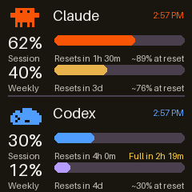

It's only turned on from the menu (**Split view**, the checkbox next to Codex), so
the left-click keeps alternating Claude and Codex. While it's on, the tray icon
shows both mascots and both providers are read every cycle (alerts keep working).
Click the icon, or untick the menu item, to go back to the provider you were on; picking
Claude or Codex in the menu leaves it too. Like the other screens it's remembered
on the device, so turning it on is instant after the first time. If one provider
can't be read, its panel shows its last numbers dimmed ("! stale since 2:57 PM")
while the other keeps updating.

### Stats view

A fourth screen, also from the menu (**Estadísticas**), with your activity for
both providers. It's the **same numbers, laid out the same way, for each**, so
you can compare them at a glance:

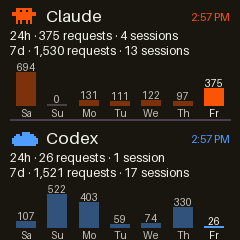

- **24h** and **7d**: requests (model calls) and sessions (conversations).
- **A bar chart of the last seven days**: requests per day, today highlighted,
  each provider scaled to its own busiest day (the number is above every bar,
  so the volumes compare too).

Both are counted the same way from each provider's own local log, `~/.claude`
(or `$CLAUDE_CONFIG_DIR`) for Claude and `~/.codex/sessions` for Codex, and
cached, recounted every 10 minutes (the first count of a large history takes a
second or two). For Claude they agree with what `claude /usage` calls "Last
24h / Last 7d". Only this machine's activity is counted. It's a still image, so
it uploads quickly. Logic: `usage_stats.py`.

### Projects and models, and peak hours

Two more screens, under **Más vistas**, from the same local logs and again
**identical for both providers**:

<table>
<tr>
  <td align="center">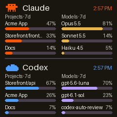<br><b>Projects and models</b></td>
  <td align="center">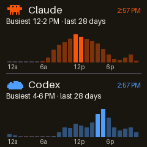<br><b>Peak hours</b></td>
</tr>
</table>

- **Proyectos y modelos:** where this week's requests went. The top three
  projects (by folder name; a folder like `frontend` or `src` is shown with its
  parent, `Storefront/frontend`) and the top three models, as shares of that
  provider's own total. Handy for seeing what's eating your limit: Opus vs
  Sonnet, or one project that dwarfs the rest.
- **Horas pico:** requests per hour of the day over the **last four weeks**, with
  the busiest two-hour stretch highlighted and named ("Busiest 12-2 PM"). Use it
  to plan heavy work for just after a session resets. Hours are local time.

Projects and models come from the folder a session ran in and the model it
called, as each log records them. Counting a month of logs takes a few seconds
the first time, so it runs in the background and the screen says "Counting..."
until it's done.

### Agent activity

The screens tell you when Claude Code or Codex is **working right now** or has
stopped and is **waiting for you**, and the tray tells you when one that had
been busy a while **finishes**, so you can walk away from a long run. It follows
**each session on its own**, so if you work in several projects at once, every
notification says which one:

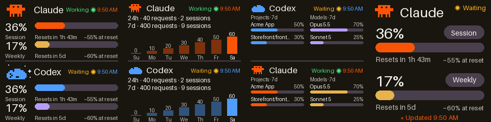

<table>
<tr>
  <td align="center">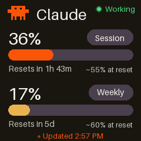</td>
  <td align="center">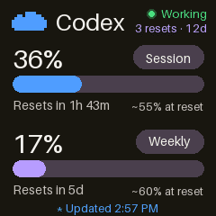</td>
</tr>
</table>

- **While it works:** a green **Working** tag (a dot and the word, by the clock)
  and the mascot switches to a working animation (Claude at its laptop, Codex
  typing brackets) instead of the random one. The tray's tooltip says it too.
- **While it waits for you:** an amber **Waiting** tag and a different animation
  (Claude has an idea, Codex sparkles), plus a notification titled with the
  project: **"Claude · Acme App" — "Te hizo una pregunta"**, or "Espera que
  apruebes su plan", or "Espera tu aprobación (Edit)". It stays up for as long
  as it's waiting, even if you were away for an hour.
- **When it finishes:** **"Claude · Acme App" — "Terminó (trabajó 4 min)"**, but
  only for runs of a minute or more. It also works while the PC is locked or
  paused, which is exactly when you'd want to hear it. The wait and finish
  notifications are one switch under **Opciones** (*Avisar cuando un agente
  termine o te espere*).
- **Several projects at once:** each session is tracked separately (a session's
  sub-agents count as part of it), so one finishing is reported while another is
  still going, and two asking at the same time each get their own notification.
- **How it knows:** both tools keep writing a local log. Claude Code's ends in a
  finished reply (`end_turn`) when it is done and in a tool call or a tool result
  while it works. It is **waiting** when a tool call has no result and that tool
  only waits on a person: `AskUserQuestion` and `ExitPlanMode` at once, or a tool
  that normally returns in milliseconds (`Read`, `Edit`, `Write`, `Grep`...) that
  has been pending 20 seconds, which means it's waiting for you to allow it. A
  long `Bash` command looks the same from the log as a permission prompt, so it's
  never taken for waiting. Codex marks each turn `task_started` /
  `task_complete`, and a pending approval or question request counts as waiting
  (best effort: not verified against a real approval, and not every setup records
  them). A log that goes quiet is treated as abandoned after a while. Polled every
  2 seconds. Logic: `agent_activity.py`.

### Codex's free resets

Codex grants free rate-limit resets that expire. Its screen shows how many you
have left and in how many days the next one expires, top right: **"3 resets ·
12d"**, yellow from 3 days, red from 1, so one doesn't go to waste. This lives
on Codex's own screen, not in the stats view, which keeps that one identical
for both providers.

### Pace

Under each bar the screens say where you're heading, next to the reset
countdown: **"~89% at reset"** when you'll make it, or **"Full in 30m"**
(yellow, red under an hour) when you won't:

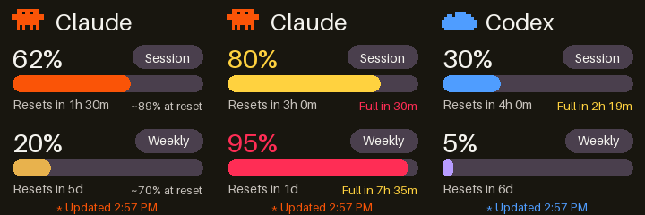

It uses the faster of your average since the window started and your pace over
the last 30 minutes (the last day for the week, and only once there's at least
a quarter of that much history, so a short burst isn't stretched over days),
so a burst of work shows up instead of being averaged away. Nothing is shown when it's too early in a window (under
8 % of it) or almost nothing has been used, and never on stale numbers. Window
lengths are 5 hours and 7 days; Codex reports its own. Logic: `pace.py`.

### Pause

- **Pausar** stops all querying and uploading until you untick it (not
  remembered across restarts, so a forgotten pause can't surprise you later).
- **Pausar al bloquear el PC** (on by default, under **Opciones**) pauses by itself
  while the computer is locked and catches up the moment you unlock. Lock
  detection is best effort: Windows asks the desktop, macOS the session
  (`Quartz`), Linux `loginctl`'s `LockedHint`; if it can't tell, it counts as
  unlocked. The tooltip says when it's paused and why.

### Screen: brightness and night mode

The device's own backlight, from **Pantalla**:

- **Brillo**: 100, 75, 50, 25, 10 or 0 %. The device takes -10 to 100 but can't
  say what it's set to, so the app remembers the level it last set.
- **Modo nocturno**: the device's own night schedule (10 PM - 7 AM at 10 % by
  default; `--night 23-6` and `--night-brightness 5` change it). Once set the
  device runs it itself, even with the computer off.
- **Atenuar al bloquear el PC**: turns the backlight down while the computer is
  locked and back to your brightness when you unlock.

Night mode and dimming need to restore your normal brightness, which the device
won't tell us, so they ask you to pick one under **Brillo** first rather than
guessing and changing it behind your back.

### Alerts

- **Colours.** From 70 % a bar and its number turn yellow, from 90 % red, on
  both providers' screens, so a glance tells you if you're running low.
- **Notifications.** A desktop notification appears the first time a provider's
  session or week reaches **80 %** and **95 %**, and again when that window
  **resets**. It watches *both* providers even when only one is on screen
  (the hidden one is read every 2 minutes). Each alert fires once, also across
  restarts. Turn them off from the menu (**Notifications**); the choice is remembered.
  Thresholds live in `alerts.py`.
- **How notifications are sent.** Each alert is shown **once**, by the tray app
  itself (the one Windows lists as "Python"). Only if that fails does the
  system's own route (`notifier.py`: a PowerShell toast on Windows, `osascript`
  on macOS, `notify-send` on Linux) step in as a backup; sending both made every
  alert appear twice. The backup's text travels in environment variables, never
  inside a command. `GEEKMAGIC_NO_NOTIFY=1` turns that backup off (the tests use it).
- **One copy at a time.** The tray app holds a lock file (`tray.lock`) while it
  runs; a second copy exits right away instead of fighting over the screen and
  doubling the notifications.

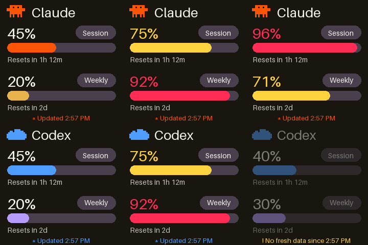

*Top: Claude at 45 % / 75 % / 96 %. Bottom: Codex at 45 %, 75 %, and the dimmed "no fresh data" screen.*

### Stale data

If the numbers can't be refreshed for 3 minutes (say Claude Code is logged out
or you lost internet but the screen is still reachable), the screen shows the
last reading **dimmed** with "! No fresh data since 2:57 PM" instead of passing
it off as current. It goes back to normal on the next successful read.

### Finding the device

You can leave `--ip` out. The app tries the address you gave, then the last one
it remembers, and otherwise scans your local network (about 4 s) for something
answering like a SmallTV (`/space.json`). If the screen later stops answering,
it scans again after a minute, so a new address after a router restart or a
power cut is picked up by itself (it notifies you, and remembers it).
`python geekmagic_claude.py --discover` lists what it finds. If you have several
screens, pass `--ip` to say which one.

### Start it at login (any OS)

```bash
python tray.py --install-startup                      # creates the right thing for your OS
python tray.py --ip 192.168.1.18 --install-startup    # ...pinning the device address
python tray.py --uninstall-startup
```

- **Windows:** a Task Scheduler task (`GeekMagicClaude`) that runs at logon, windowless.
- **macOS:** a LaunchAgent `~/Library/LaunchAgents/com.geekmagic.claude-usage.plist`
  (restarts after a crash, not after you choose Quit; sets a `PATH` that
  includes Homebrew and `~/.local/bin` so `claude`/`codex` are found).
- **Linux:** an autostart entry `~/.config/autostart/geekmagic-claude-usage.desktop`
  (needs a desktop with a system tray / AppIndicator).

## Animations

By default (`--animation auto`) every push picks a random animation from the
provider's own set, never one of the last three that played. Pass
`--animation NAME` to pin one instead (`random` is the same as `auto`). All of
them live side by side in the `ANIMATIONS` dict in `geekmagic_claude.py` —
picking one never deletes another, and adding a new one is just a new entry.

```bash
python geekmagic_claude.py --ip 192.168.1.18 --animation coffee
python geekmagic_claude.py --ip 192.168.1.18 --provider codex --animation bolt
```

### Claude

<table>
<tr>
  <td align="center"><br><code>idle</code></td>
  <td align="center">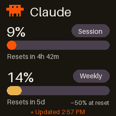<br><code>laptop</code></td>
  <td align="center">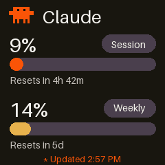<br><code>coffee</code></td>
</tr>
<tr>
  <td align="center">Just the mascot's gentle idle bob</td>
  <td align="center">Pulls a tiny laptop up into view and holds it</td>
  <td align="center">Pulls out a mug of coffee, with steam wisps rising</td>
</tr>
<tr>
  <td align="center"><br><code>eureka</code></td>
  <td align="center"><br><code>dance</code></td>
  <td align="center"><br><code>typing</code></td>
</tr>
<tr>
  <td align="center">A little idea spark pops up beside its head</td>
  <td align="center">A side-to-side wiggle dance</td>
  <td align="center">Like <code>laptop</code>, plus a moving cursor on the little screen</td>
</tr>
</table>

### Codex

<table>
<tr>
  <td align="center">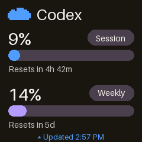<br><code>prompt</code></td>
  <td align="center"><br><code>think</code></td>
  <td align="center"><br><code>sparkle</code></td>
</tr>
<tr>
  <td align="center">The <code>&gt;_</code> appears, the cursor blinks, three dots get typed</td>
  <td align="center">The cloud bobs while thinking dots come and go</td>
  <td align="center">Sparkles twinkle around the cloud</td>
</tr>
<tr>
  <td align="center"><br><code>bolt</code></td>
  <td align="center">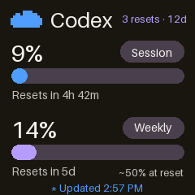<br><code>code</code></td>
  <td align="center">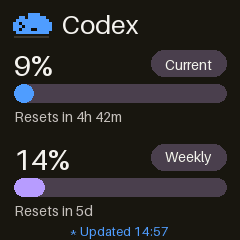<br><code>hop</code></td>
</tr>
<tr>
  <td align="center">The cloud flashes and a lightning bolt strikes</td>
  <td align="center"><code>[ ... ]</code> brackets appear with dots typed inside</td>
  <td align="center">The cloud hops, its shadow shrinking as it rises</td>
</tr>
</table>

### Adding your own

Each animation is a tuple of `(mascot_dx, mascot_dy, extra)` per GIF frame,
where `extra` is an optional `(image, mascot_width) -> None` drawing hook
(see `_laptop_layer`, `_mug_layer`, `_bulb_layer` for Claude and
`_prompt_layer`, `_bolt_layer`, `_hop_layer` for Codex). Chain several hooks
with `_combine(...)`. Define a small bitmap (a tuple of equal-length strings,
one character per pixel), a tiny drawing function, a layer closure, add the
key to `ANIMATIONS`, and list it in `ANIMATION_GROUPS` under the provider it
belongs to. A new provider is a new entry in `PROVIDERS` (how to read its
usage) and `THEMES` (its mascot and colours).

## Running it without the tray (macOS launchd loop)

The included `com.example.geekmagic-claude.plist` is a
[launchd](https://www.launchd.info/) LaunchAgent that runs the plain command
line script in the background, at login and on a timer. (The tray app's
`--install-startup` is simpler if you want the tray.)

1. Copy it and fill in the placeholders:
   ```bash
   cp com.example.geekmagic-claude.plist ~/Library/LaunchAgents/com.yourname.geekmagic-claude.plist
   ```
   Edit that copy:
   - `Label` — make it match the filename (e.g. `com.yourname.geekmagic-claude`)
   - The `python3` path — run `which python3` and use that exact path
   - The path to `geekmagic_claude.py` — wherever you cloned this repo
   - `--ip` — your device's IP (and `--provider codex` for Codex)
   - Both `StandardOutPath`/`StandardErrorPath` — anywhere you want the log written

2. Load it:
   ```bash
   launchctl load ~/Library/LaunchAgents/com.yourname.geekmagic-claude.plist
   ```

It runs once immediately (`RunAtLoad`) and every 60 seconds (`StartInterval`)
while you're logged in, and restarts after a reboot or logout/login.

```bash
tail -f /path/to/your/log.txt                                            # watch it work
launchctl unload ~/Library/LaunchAgents/com.yourname.geekmagic-claude.plist   # pause
launchctl load   ~/Library/LaunchAgents/com.yourname.geekmagic-claude.plist   # resume
```

**Gotchas**

- If your script directory is under `~/Downloads`, `~/Desktop`, or
  `~/Documents`, macOS's privacy protection (TCC) can block a launchd job from
  reading it with a silent `Operation not permitted`, even though running it by
  hand works (Terminal already has disk access; launchd doesn't). Move the
  folder elsewhere (e.g. `~/Library/Application Support/geekmagic-claude-usage`).
- launchd does not load your shell's `PATH`, so if `claude` or `codex` lives
  in `/opt/homebrew/bin` (Homebrew on Apple Silicon), add it to the plist's
  `EnvironmentVariables` (already done in the example file).
- A repeating "`python3.13` wants access to data from other apps" prompt is
  Claude Code's "Claude in Chrome" integration reaching for Chrome via Apple
  Events on every run. `fetch_usage()` already passes `--no-chrome`, which
  stops it.

Other platforms: use `cron`, a `systemd --user` timer, or Windows Task
Scheduler to run `python3 geekmagic_claude.py --ip ... [--provider codex]` on a
schedule — or just use the tray app's `--install-startup`.

## Tests

All the tests live in [`tests/`](tests/) and need nothing but Python: no real
device, no Claude Code or Codex login (the device, the network and the
providers are faked).

```bash
python -m unittest                      # everything, from the repo root
python -m unittest tests.test_alerts    # one file
```

| File | Covers |
|---|---|
| `test_alerts.py` | colour thresholds and when notifications fire |
| `test_pace.py` | pace projection: where a window ends up, when it runs out |
| `test_agent_activity.py` | deciding from the logs whether Claude / Codex is working, waiting for you or idle, per session |
| `test_login.py` | opening a provider's sign-in per OS (quoting, terminals), and telling "signed out" from other failures |
| `test_tray_signin.py` | picking a signed-out provider opens its sign-in once, and its screen says so |
| `test_notifier.py` | the system-route backup per OS, and that nothing in the text can break (or inject into) the command |
| `test_single_instance.py` | a second copy can't start while the first runs, and the lock frees up afterwards |
| `test_response_times.py` | small-but-identical GIFs, one request to show an image, parallel reads, start-up order |
| `test_usage_stats.py` | the same activity stats for both providers (counts, sessions, daily chart, cache), Codex's free resets |
| `test_session_lock.py` | screen-lock detection (real here, mocked for macOS / Linux) |
| `test_brightness.py` | brightness and night mode, against a fake device |
| `test_codex_usage.py` | the Codex limits query (against a fake `app-server`) |
| `test_discover.py` | finding the device on the network |
| `test_render_states.py` | alert colours, stale dimming, 12-hour clock, split and stats views, pace on screen |
| `test_device_errors.py` | a device that cuts responses short is treated as unreachable |
| `test_tray_logic.py` | tray behaviour: view restore, alerts, pace history, pause and lock, brightness, stats view, rediscovery, clicks vs uploads |

The tray tests need a desktop session (they build the tray icon objects) and
skip themselves without one.

## Firmware API reference (stock SmallTV Ultra)

Discovered by probing a real device; documented here since GeekMagic's own
docs don't cover it:

| Action | Endpoint |
|---|---|
| Upload an image/GIF | `POST /doUpload?dir=/image/` (multipart field `file`; same filename overwrites) |
| Pin it on screen | `GET /set?img=/image/<filename>` (requires Photo Album theme) |
| Switch to Photo Album | `GET /set?theme=3` |
| Delete a file | `GET /delete?file=/image/<filename>` |
| List files | `GET /filelist?dir=/image/` (HTML table) |
| Free space | `GET /space.json` |

Animated GIFs are decoded and looped **on the device itself** — one upload per
push, no per-frame network traffic. The device handles one request at a time,
answers each in ~0.3 s and stores an upload at ~25–45 ms per KB plus ~0.8 s
fixed, which is why the tray app uploads each view into two alternating files
(`<view>-usage-a.gif` / `-b.gif`) and switches views with just a `/set?img=`
call. Keep GIFs well under the device's free space (`/space.json`); these run
3–25 KB (see [Response times](#response-times)). `/set` answers `OK`, or `FAIL`
for what it doesn't know or can't find.

## Response times

Where the time goes, measured on a real SmallTV, and what was done about it:

| | Before | Now |
|---|---|---|
| Show a stored image (every click) | 0.6 s (two requests) | **0.3 s** (one) |
| Upload a single-screen GIF | 2.4 s (51 KB) | **1.4 s** (10 KB) |
| Upload a working / animated GIF | 4.2 s (117 KB) | **1.4 s** (15 KB) |
| Upload the split view | 4.3 s (122 KB) | **1.6 s** (22 KB) |
| Read both providers (split view cycle) | 4.3 s one after the other | **3.4 s** in parallel |
| An agent starts working → the screen says so | up to ~10 s | **~3-4 s** |
| An agent finishes → the screen says so | ~15 s | **~6-8 s** |
| Start-up → remembered view on screen | after searching and listing files (~1.5 s) | **first**, in one request |

(The two agent rows are worked out from the polling interval, the quiet period
that has to pass before a run counts as over, and the measured upload times; the
rest were timed on a real device. Finishing takes longer than starting on purpose:
four quiet seconds in a row are needed, so the gaps between an agent's steps
don't flicker the screen or send a notification too early.)

- **Frame-difference GIFs.** The screens are static except for a mascot, so each
  frame after the first is stored as just the rectangle that changed
  (`disposal=1`): 5-10x smaller, and decoded to exactly the same frames (there's
  a test). The device takes most of an update's time just storing the file, so
  this is the big one.
- **One request to show an image.** The Photo Album theme is only selected the
  first time, or again if the device ever refuses an image.
- **Parallel reads.** A view of both providers waits for the slower read (Claude's
  `/usage`, ~3.5 s) instead of both added up (Codex's is ~1 s).
- **Quicker agent detection.** Polled every 2 s from cached per-log summaries (a log
  that hasn't changed isn't read again), and a start or stop is redrawn from the
  readings already in hand instead of querying again.
- **Cancel, don't queue.** A click aborts an upload in flight, and no background
  upload starts for a few seconds after one, so a click never waits behind one.

## Why this exists / prior art

A few public projects inspired pieces of this one:

- [MyrikLD/GeekMagic-Clawdmeter](https://github.com/MyrikLD/GeekMagic-Clawdmeter) —
  custom Rust firmware for the SmallTV PRO that reads Anthropic's
  undocumented `/api/oauth/usage` endpoint directly over WiFi. Closest in
  spirit, but it **replaces** the stock firmware entirely.
- [hsmloktar/geekmagic-ai-usage-monitor](https://github.com/hsmloktar/geekmagic-ai-usage-monitor) —
  the source of the "shell out to the local CLI's own usage command"
  approach used here, generalized across Codex and Claude.
- [epicsagas/AgentGlance](https://github.com/epicsagas/AgentGlance) — a
  Claude Code plugin that turns a GeekMagic SmallTV into a live
  WORKING/APPROVAL/DONE session-status display (context %, tokens) rather
  than an account-wide quota display; also the source of several of the
  stock-Ultra firmware API details documented above.

This project takes a different, narrower path: no firmware changes, no OAuth —
just each provider's own local CLI and a few plain HTTP calls to the stock device.

## Disclaimer

The mascots are original pixel-art designs made for this project — the little
creature is **not** an official Anthropic/Claude logo or asset, and the cloud
is **not** an OpenAI/Codex logo or asset. This project is unaffiliated with
Anthropic, OpenAI and GeekMagic; it talks to each of their products only
through the interfaces they already expose (Claude Code's local `/usage`
command, the Codex CLI's account-limits call, and the device's own stock HTTP API).

## License

MIT — do whatever you want with it.
